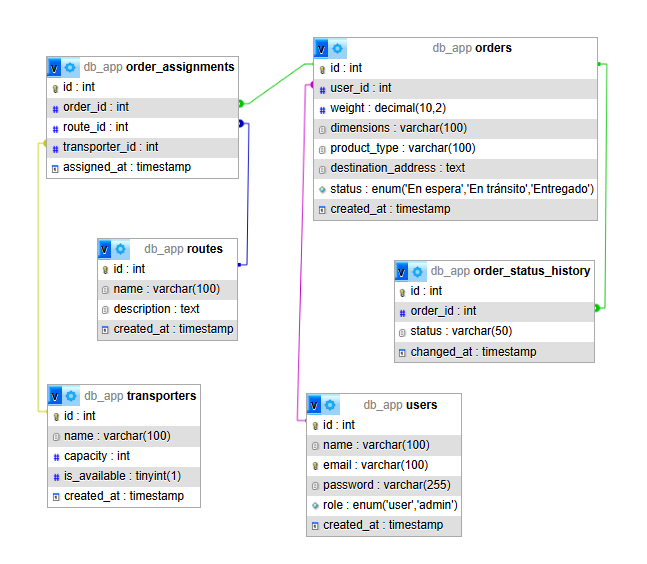

# 📦 APP de Envíos API - Sistema de gestión de envíos

Este proyecto es una API RESTful construida en Node.js con TypeScript para la gestión de órdenes de envío. Permite registrar usuarios, crear órdenes, asignar transportistas y rutas, actualizar estados, generar reportes y más. Está pensada para cubrir un flujo completo de logística con soporte en caché, notificaciones en tiempo real y envío de correos electrónicos automáticos.

---

## 🚀 Tecnologías utilizadas

### Backend
- **Node.js**
- **TypeScript**
- **Express**
- **MySQL**
- **Redis**
- **WebSocket (ws)**
- **Swagger (Documentación de API)**
- **JWT jsonwebtoken (JSON Web Tokens)**
- **Zod (Validación de esquemas)**
- **bcryptjs** (Hashing de contraseñas)
- **SendGrid** (Envío de correos transaccionales)
- **LocationIQ** (Serviio tercero para validación de direcciones)
- **Jest** (Pruebas)
- **Docker**

---

## 🧰 Buenas prácticas aplicadas

- **Principios SOLID**: El código está diseñado respetando los principios de responsabilidad única, separación de preocupaciones y extensibilidad.
- **Clean Architecture**: División clara en capas (usecases, controllers, repository, entities, shared).
- **Patrón de carpetas modular**: Cada módulo (auth, orders, transporters, etc.) tiene sus propias rutas, controladores, casos de uso y validaciones.
- **Validación de datos**: Los inputs son validados con `zod`.
- **Autenticación y autorización por roles**: Protecciones con middlewares.
- **Cache con Redis**: Optimización de respuestas para endpoints pesados.
- **Notificaciones en tiempo real**: WebSocket integrado para actualización de estados.

---

## 🧱 Estructura general del proyecto

```
backend/
│
├── src/
│   ├── modules/               # Módulos funcionales (auth, orders, cache, etc.)
│   ├── shared/                # Config, middlewares, utils, db, servicios comunes
│   ├── entities/              # Interfaces tipadas de cada entidad
│   ├── routes/                # Configuración de rutas principales
│   ├── docs/                  # Configuración de Swagger
│   ├── index.ts               # Punto de entrada del servidor
│   └── app.ts                 # Configuración base de la app Express
│
├── .env                       # Variables de entorno
├── docker-compose.yml         # Contenedor MySQL, Redis y phpMyAdmin
├── package.json
├── tsconfig.json
└── README.md                  # Este archivo
```

---

## ✅ Pruebas automáticas

El proyecto incluye un set de pruebas unitarias con **Jest** y **Supertest**, mockeando servicios para validar casos de uso importantes del sistema:

```bash
npm run test
```

---

## 🗄️ Modelado de Base de Datos



---

## 📚 Endpoints principales

> A continuación se listan los principales endpoints disponibles. La documentación completa con ejemplos está disponible mediante Swagger.

| Método | Ruta                             | Descripción                                        |
|--------|----------------------------------|----------------------------------------------------|
| POST   | `/api/v1/auth/register`         | Registrar nuevo usuario                            |
| POST   | `/api/v1/auth/login`            | Login de usuario y obtención de token              |
| GET    | `/api/v1/orders`                | Listar órdenes (filtrables)                        |
| POST   | `/api/v1/orders`                | Crear nueva orden                                  |
| PUT    | `/api/v1/orders/:id/status`     | Actualizar estado de orden                         |
| POST   | `/api/v1/orders/:id/assign`     | Asignar ruta y transportista a orden               |
| GET    | `/api/v1/orders/:id/status`     | Consultar estado actual de orden                   |
| GET    | `/api/v1/orders/:id/history`    | Consultar historial de estados de orden            |
| GET    | `/api/v1/orders/history/my`     | Historial de ordenes de un usuario                 |
| GET    | `/api/v1/orders/history/all`    | Historial completo de todas las órdenes (admin)    |
| GET    | `/api/v1/reports/orders`        | Obtener reportes detallados de órdenes             |
| DELETE | `/api/v1/cache/reports`         | Eliminar caché de reportes                         |
| DELETE | `/api/v1/cache/orders/status`   | Eliminar caché de estatus de ordenes               |
| GET    | `/api/v1/cache/keys`            | Ver todas las claves almacenadas en Redis          |

📄 La documentación detallada con esquemas y ejemplos está disponible en:

```
http://localhost:3000/api/v1/doc-api
```

---

## 🛠️ Instalación del proyecto

```bash
# 1. Clonar el repositorio
git clone <repositorio>

# 2. Ingresar a la carpeta
cd <a la carpeta>

# 3. Instalar dependencias
npm install

# 4. Levantar los contenedores
docker-compose up -d

# 5. Ingresar a phpMyAdmin
http://localhost:8080

# 6. Ejecutar el script de base de datos:
# - init.sql
# - (opcional) seed.sql si tienes datos de ejemplo

# Acceso a usuarios
# 🛡️ Admin:     admin@example.com / admin123
# 👤 Usuario:   user@example.com  / user123
# Puedes cambiar los emails de prueba pero los passwords debes conservarlos ya que se crean hasheados
```

---

## 📬 Contacto

**Jorge Munera**  
Fullstack Software Developer  
📍 Colombia  
📞 +57 316 823 4878  
📧 gerjo9211@hotmail.com  

---

> Gracias a todos por leer el proyecto 🙌🏼 ¡Espero que les sea útil!
